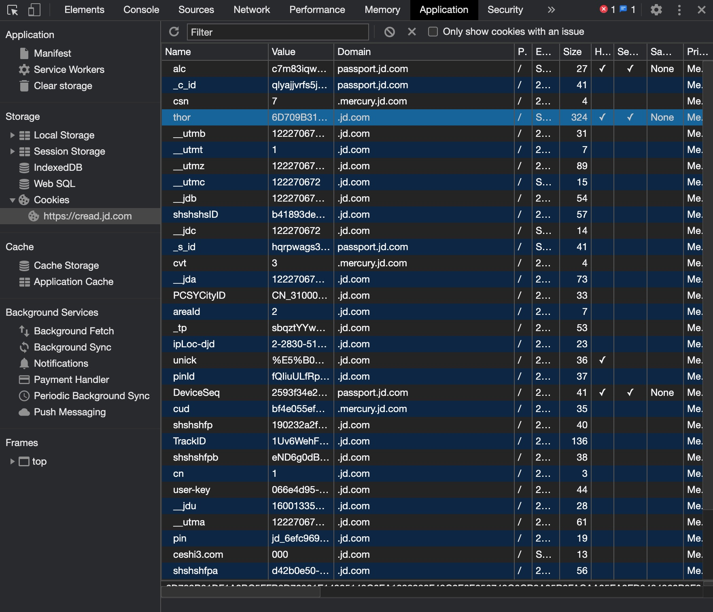
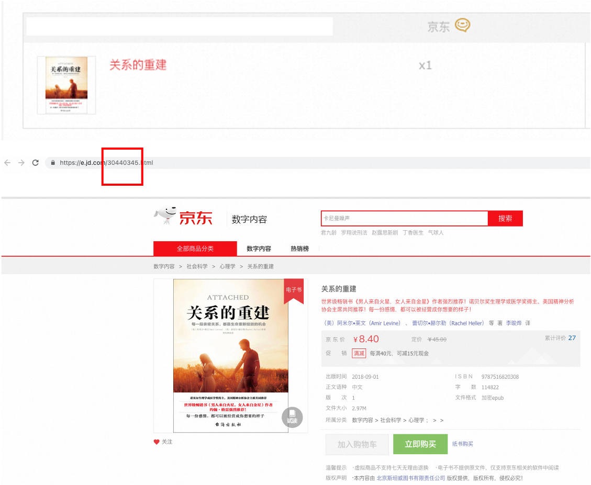

一键导出京东阅读已购买的电子书

last modify@2023.05.19

## 使用前说明

网络上参考的两个下载脚本[<sup>1,</sup>](#refer-anchor)[<sup>2</sup>](#refer-anchor)分别对应京东校园版和过时了的京东阅读，后者又没有把PR合并进去，所以这里直接再上传一个现在能用的略微修改版

## 如何使用
step0: 下载代码, 并安装依赖

```bash
git clone https://github.com/rmlzy/export_jd_read.git
cd hack_jd_read
npm install
```

step1:
登录[京东读书](https://e.jd.com/), 拷贝页面 cookie 中的 thor 值, 到 `index.js` 的 `thor` 变量里



step2: 在我的订单页面, 点击某个购买过的电子书，之后会直接跳转到这个电子书的`e.jd`界面如


这里可直接获得`bookId`了

step3: 记住页面 URL 地址中的 `bookId` 和 `readType` 参数, 例如: `https://cread.jd.com/read/startRead.action?bookId=30506710&readType=3`

note: 这里虽然我在浏览器上阅读的URL，如`https://cread.jd.com/read/startRead.action?bookId=30440345&readType=1` `readType`默认初始为1，但好像还是3能全部加载完🤔️

step4: 执行 `npm run start`, 并输入 step3 的 `bookId` 和 `readType` 值即可

程序会自动将导出的章节存储到 `output` 目录.

## 使用说明
+ 此脚本不会保存或者上传你的 Cookie;
+ 如有侵权请联系我删除!

## LICENSE
MIT

<div id="refer-anchor"></div>

## REFERENCE

[1] [下载京东校园版阅读中电子书](https://github.com/goodwjf/export_jd_read)
[2] [下载京东阅读电子书-old](https://github.com/rmlzy/export-jd-read)